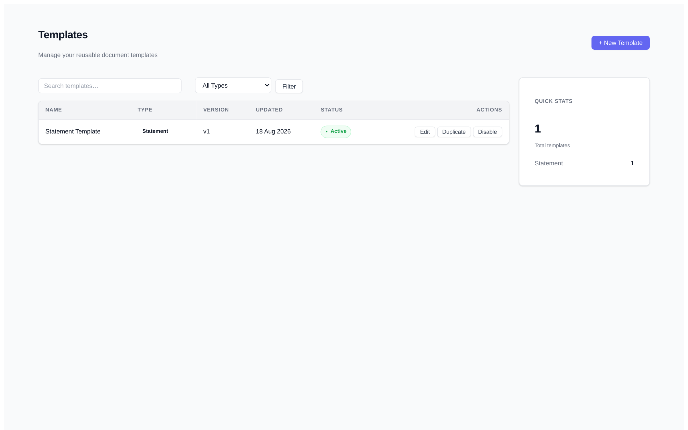
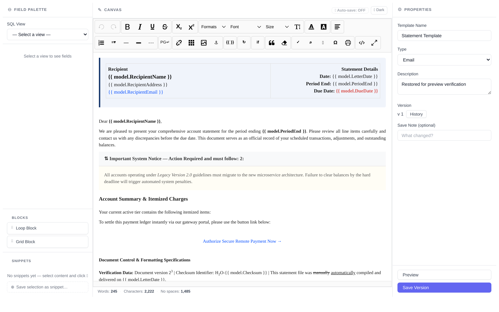
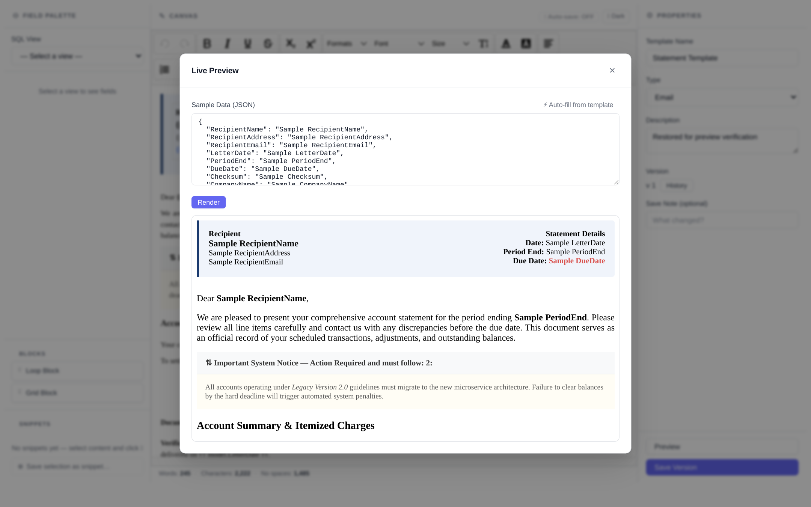
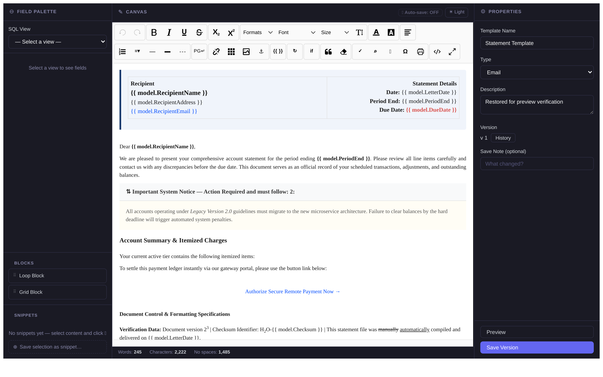

# TemplateBuilder.Editor.Mvc5

**Current version: 1.3.0**

Embed a full Scriban-powered HTML template management UI into any ASP.NET MVC 5 application running on .NET Framework 4.8. Install the package, register a Unity container, wire up two routes — and your users can create, edit, version, compare, preview, and restore templates with reusable snippets, all wrapped in your own site layout.

The same product line as [`TemplateBuilder.Editor`](https://www.nuget.org/packages/TemplateBuilder.Editor) (ASP.NET Core / .NET 8+), rebuilt for the MVC 5 / EF6 / Unity stack.

---

## Screenshots

| Template list | 3-panel editor (light) |
|---|---|
|  |  |

| Live preview | Editor (dark theme) |
|---|---|
|  |  |

---

## Requirements

- .NET Framework 4.8
- ASP.NET MVC 5.x (`System.Web.Mvc` 5.3.0)
- Unity 5.x + `Unity.Mvc5` 1.4.x
- Entity Framework 6.x
- SQL Server (any edition — schema is created for you)
- Newtonsoft.Json 13.x, RazorGenerator.Mvc 2.4.x (pulled in automatically)

> **Note:** the editor ships with precompiled Razor views and its own bundled JavaScript/CSS — no `.cshtml` files are ever copied into your project.

---

## Quick Start

### 1. Install

Package Manager Console:

```powershell
Install-Package TemplateBuilder.Editor.Mvc5
```

> The package ships a `tools/install.ps1` that lists the recommended assembly binding redirects (Newtonsoft.Json 13, EntityFramework 6.5.1, System.Text.Json 10) for `packages.config`-style projects.

### 2. Add a connection string

```xml
<!-- Web.config -->
<connectionStrings>
  <add name="TemplateDb"
       connectionString="Server=.;Database=TemplateBuilder;Trusted_Connection=True;TrustServerCertificate=True;"
       providerName="System.Data.SqlClient" />
</connectionStrings>
```

### 3. Register in your Unity bootstrapper

```csharp
using System.Web.Mvc;
using TemplateBuilder.Editor.Mvc5;
using Unity;
using Unity.Mvc5;

public static class UnityConfig
{
    public static void RegisterComponents()
    {
        var container = new UnityContainer();

        container.RegisterTemplateBuilderEditor(options =>
        {
            options.ConnectionString =
                System.Configuration.ConfigurationManager.ConnectionStrings["TemplateDb"].ConnectionString;
        });

        DependencyResolver.SetResolver(new UnityDependencyResolver(container));
    }
}
```

Call `UnityConfig.RegisterComponents()` from `Application_Start` (or wherever your app boots).

### 4. Wire up routing

In `RouteConfig.RegisterRoutes`, **before** your conventional catch-all route:

```csharp
using TemplateBuilder.Editor.Mvc5;

public static void RegisterRoutes(RouteCollection routes)
{
    TemplateBuilderEditorRouteConfig.RegisterRoutes(routes); // attribute routes + /TemplateBuilderEditor assets

    routes.MapRoute(
        name: "Default",
        url: "{controller}/{action}/{id}",
        defaults: new { controller = "Home", action = "Index", id = UrlParameter.Optional });
}
```

### 5. Register the precompiled view engine

The editor's views are compiled into the package assembly (RazorGenerator). Add them to the view engine list in `Application_Start`:

```csharp
ViewEngines.Engines.Clear();
ViewEngines.Engines.Add(new PrecompiledMvcEngine(typeof(TemplateBuilder.Editor.Mvc5.UnityContainerExtensions).Assembly));
ViewEngines.Engines.Add(new RazorViewEngine()); // your own views
```

### 6. Link the editor assets

The editor's CSS/JS are served from `/TemplateBuilderEditor/...` and rendered inside a `#tb-editor-host` container, so they cannot collide with your page's Bootstrap 3 (or other) styles:

```html
<head>
    <link href="/TemplateBuilderEditor/css/suneditor.min.css" rel="stylesheet" />
    <link href="/TemplateBuilderEditor/css/template-editor.css" rel="stylesheet" />
</head>
<body>
    <!-- add a link to the editor somewhere in your nav: -->
    <a href="/Templates">Templates</a>

    @RenderBody()

    <script src="/TemplateBuilderEditor/js/suneditor.min.js"></script>
    <script src="/TemplateBuilderEditor/js/template-editor.js"></script>
</body>
```

### 7. Run

EF6 migrations apply automatically on first startup — the database and schema are created for you. Navigate to `/Templates`.

---

## Access Control

By default the editor is **open to all users** — no authentication is required. To restrict access, add the editor's global authorization filter and configure `options.Authorization`:

```csharp
// FilterConfig.RegisterGlobalFilters — protects every editor route
filters.Add(new TemplateBuilderAuthorizationFilter());
```

#### Anonymous (default — no change required)

```csharp
container.RegisterTemplateBuilderEditor(options =>
{
    options.ConnectionString = ...;
    // options.Authorization.Mode defaults to Anonymous
});
```

#### Authenticated users only

Any signed-in user can access the editor.

```csharp
using TemplateBuilder.Editor.Mvc5.Authorization;

options.Authorization.Mode = TemplateBuilderAuthorizationMode.Authenticated;
```

#### Role-based access

A user in **any** of the listed roles is granted access (OR logic).

```csharp
using TemplateBuilder.Editor.Mvc5.Authorization;

options.Authorization.Mode = TemplateBuilderAuthorizationMode.Role;
options.Authorization.RoleNames = new[] { "Admin", "Supervisor" };
```

#### Custom authorization (escape hatch)

For claims-based or composite rules, register your own `IAuthorizationFilter` under a name and point the editor at it:

```csharp
// 1. Register your filter during startup
TemplateBuilderAuthorizationPolicyRegistry.Register(
    "TemplateEditorAccess", new MyCustomAuthorizationFilter());

// 2. Point the editor at it
options.Authorization.PolicyName = "TemplateEditorAccess";
```

#### What is protected

The filter applies to every editor controller — the full route surface (`/Templates/*` including Edit, Preview, SaveVersion, Versions, Restore, Duplicate, Validate, ToggleActive, the Snippets API, `/Audit`, and `/_setup`).

---

## Author Identity (CreatedBy)

Every TemplateBuilder table that records an author (`TemplateVersion.CreatedBy`,
`SnippetVersion.CreatedBy`, snippet usage `UsedBy`, and the audit log `Actor`) is stamped
with the current user (imported template versions keep their original author from the
export file), resolved in this order:

1. **`options.ActorResolver`** (your custom resolver, if set)
2. `User.Identity.Name`
3. `"anonymous"`

Without configuration the editor stores `User.Identity.Name` (or `"anonymous"` when the
request is unauthenticated or the name is empty). Existing records are never backfilled —
legacy rows display `"anonymous"` in the UI.

Supply your own identity from your existing `RegisterTemplateBuilderEditor` call — e.g. a
claims value:

```csharp
container.RegisterTemplateBuilderEditor(options =>
{
    options.ConnectionString = connectionString;
    // Store the "sub" claim (or any claim / custom user lookup) as the author
    options.ActorResolver = ctx => ctx.User?.FindFirst("sub")?.Value;
});
```

The resolver receives the request's `HttpContextBase`, so it can read claims, session, or
any of your own services captured in the closure. It runs once per request; a `null` or
blank result falls back to the chain below it. Values are stored as returned — trim
inside the resolver if your source may carry stray whitespace. The stored value is
truncated to 200 characters (the column limit). Exceptions thrown by your resolver
propagate.

---

## Setup Diagnostic Page

After installation, navigate to **`/Templates/_setup`** (requires `<compilation debug="true" />`; returns 404 otherwise) to verify every integration requirement at once:

| Check | What it detects |
|---|---|
| Database connection | SQL Server reachable with the configured connection string |
| `MapMvcAttributeRoutes()` registered | Attribute-routed endpoints (Edit, Preview, SaveVersion, Versions) are reachable |
| Static assets serving | `/TemplateBuilderEditor/...` is being served |

Every failing check shows a one-line fix.

---

## Features

| Feature | Route |
|---|---|
| Template list | `GET /Templates` |
| Create template | `GET/POST /Templates/Create` |
| Edit template | `GET /Templates/{id}/Edit` |
| Save draft version | `POST /Templates/{id}/SaveVersion (isActive:false)` |
| Save version | `POST /Templates/{id}/SaveVersion` |
| Version history | `GET /Templates/{id}/Versions` |
| Version body (for compare) | `GET /Templates/{id}/Versions/{versionId}/Body` |
| Restore version | `POST /Templates/{id}/Restore/{versionId}/{sourceVersionNumber}` |
| Live preview | `POST /Templates/{id}/Preview` |
| Duplicate | `POST /Templates/{id}/Duplicate` |
| Validate syntax | `POST /Templates/{id}/Validate` |
| Toggle active | `POST /Templates/{id}/ToggleActive` |
| List snippets | `GET /Templates/Api/Snippets` |
| Create snippet | `POST /Templates/Api/Snippets` |
| Update snippet | `PUT /Templates/Api/Snippets/{id}` |
| Delete snippet | `DELETE /Templates/Api/Snippets/{id}` |
| Snippet version history | `GET /Templates/Api/Snippets/{id}/Versions` |
| Restore snippet version | `POST /Templates/Api/Snippets/{id}/Restore/{versionId}` |
| Record snippet usage | `POST /Templates/Api/Snippets/{id}/Usage?templateId={id}` |
| Template audit timeline | `GET /Templates/{id}/Audit` |
| Global audit log | `GET /Audit` |
| Audit CSV export | `GET /Audit/Export` |
| Export template (JSON incl. versions) | `GET /Templates/Export/{id}` |
| Import template export file | `POST /Templates/Import` |
| Bulk activate | `POST /Templates/BulkActivate` |
| Bulk deactivate | `POST /Templates/BulkDeactivate` |
| Bulk export ZIP | `POST /Templates/BulkExport` |
| Bulk delete | `POST /Templates/BulkDelete` |
| Template health check | `GET /Templates/{id}/Health` |
| Health overview page | `GET /Health` |
| Health summaries (badges) | `GET /Health/Summaries?ids=1,2` |
| Setup check | `GET /Templates/_setup` *(debug only)* |

---

## Governance & Compliance

### Two-state saves

Templates use a simple two-state save model — there is no review/approval workflow:

- **Each version is either Draft or Active** (`TemplateVersion.IsActive`). **Save draft version** saves the current body as a new Draft version; **Save version** saves it as the Active version (the live one). Both kinds of versions carry the same full version history, compare, and restore capabilities.
- **The editor shows the latest version**, with a "Draft version" badge when the latest version is a draft; the version history lists every version with an **Active** / **Draft** badge.
- **The render API serves the last Active version.** `ITemplateEngine.RenderAsync` / `RenderByNameAsync` throw `TemplateNotFoundException` (no such template), `TemplateInactiveException` (the template is not servable), or `NoActiveVersionException` (no Active version exists yet) instead of silently rendering a draft.
- **Template `IsActive` is the servable switch** — `POST /Templates/{id}/ToggleActive` (or the bulk Activate/Deactivate actions) turns serving on/off independently of which version is latest. A template can be active as a whole while its latest version is still a draft.

### Audit log (append-only)

Every meaningful action — version saves/restores (draft and active), snippet create/edit/restore/delete — is written to an append-only `AuditLog` table. Rows are never updated or deleted. (Snippet *usage* is tracked separately in the `SnippetUsages` table, not the audit log.)

- **Per-template timeline** — `GET /Templates/{id}/Audit`, also rendered in the editor's Timeline panel (newest first).
- **Global audit view** — `GET /Audit` with filters (entity type, action, actor, date range, search) and paging.
- **CSV export** — `GET /Audit/Export` downloads `template-builder-audit.csv` with columns `OccurredAt,EntityType,EntityId,Action,Actor,Comment` (UTF-8 with BOM).

### Snippet governance

- Snippets have **version history and usage tracking**. An edit that changes the body creates a new version; metadata-only edits do not. `GET /Templates/Api/Snippets/{id}/Versions` lists history, and `POST /Templates/Api/Snippets/{id}/Restore/{versionId}` restores a version — a restore itself creates a new version, so no state is lost. (The initial body is captured as v1 on the first body change; a never-edited snippet has no version rows yet.)
- Concurrent snippet edits are rejected with `409` via a row-version concurrency token.
- Inserting a snippet into a template records usage — `POST /Templates/Api/Snippets/{id}/Usage?templateId={id}` — and the snippet list shows "used Nx in M templates".

---

## Lifecycle & Ops

### Export / import (dev → prod promotion)

- **Export** — `GET /Templates/Export/{id}` downloads a camelCase JSON document (`schemaVersion: 2`) containing the template metadata, its `externalKey` (a stable GUID identity assigned at creation), and the full ordered version history — each version carrying its `isActive` flag. The list page has an **Export** row action; `POST /Templates/BulkExport` packages multiple templates into a ZIP with a `_summary.json` manifest.
- **Import** — `POST /Templates/Import` (multipart file upload) matches by `externalKey`: templates with a matching key in the target environment get their metadata updated and their versions appended (continuing from the target's next version number); new keys create new templates with original version numbers preserved. **Documents with `schemaVersion != 2` are rejected** (v1 exports are not imported); per-version `isActive` flags and the template `isActive` switch are preserved exactly — nothing is skipped or collapsed.
- The import modal on the list page renders per-entry results (created / updated with "N versions appended" / skipped / errors).
- `SourceView`/`SourceViewSnapshot` are deliberately **not** exported — they are environment-local schema expectations, not part of the template.

### Template health check (field drift vs live schema)

- Bind a template to a SQL view via the **Source SQL View** select in the editor's Properties panel (saving refreshes a stored snapshot of that view's columns).
- `GET /Templates/{id}/Health` (and the editor's **Health** button) compares the template's Scriban `model.*` paths against the live view schema and reports findings: `column_missing` (Critical), `column_type_changed` / `column_length_changed` / `column_nullability_changed` (Warning, from the snapshot), `view_missing` (Critical), and `unbound_tokens` (Warning, template uses model fields but no view is bound).
- `GET /Health` is the overview page (Healthy / Warnings / Critical / Unbound stat chips and a per-template finding table); the list page's health badges poll `GET /Health/Summaries?ids=…`.

### Bulk operations

- The list page's row checkboxes reveal a bulk toolbar: **Activate**, **Deactivate**, **Export ZIP**, **Delete** (with confirmation; version history is removed, audit rows remain), and **Clear**. Each endpoint returns `{ succeeded, failed }` so partial failures are visible.

---

## Theming

The editor ships with a **light theme** by default. A **☀ Light / 🌙 Dark** toggle button appears in the CANVAS panel heading and persists your preference in `localStorage`.

The editor's styles are fully scoped to `#tb-editor-host` using CSS custom properties — they do not affect the rest of your application. The editing canvas is always white (document-like) regardless of the selected theme.

---

## Template Syntax

Templates use [Scriban](https://github.com/scriban/scriban) — access model properties via `model.*`:

```html
<p>Hello <strong>{{ model.FirstName }}</strong>,</p>

{{ for item in model.Items }}
  <p>{{ item.Name }} — {{ item.Price }}</p>
{{ end }}

{{ if model.IsPremium }}
  <p>Thank you for being a premium member.</p>
{{ end }}
```

Live preview and version-comparison output is passed through an HTML sanitizer (HtmlSanitizer), so `model.*` values cannot inject script or arbitrary markup into your rendered emails/documents. Sanitization happens in the editor's Preview endpoints — when you render templates in your own code, apply `IHtmlSanitizerService.Sanitize` to the output (as the preview endpoint does).

---

## Render Templates in Code

`TemplateBuilder.Editor.Mvc5` includes the rendering engine. Resolve `ITemplateEngine` from Unity anywhere:

```csharp
using TemplateBuilder.Domain.Interfaces;

public class WelcomeEmailBuilder
{
    private readonly ITemplateEngine _engine;

    public WelcomeEmailBuilder(ITemplateEngine engine) => _engine = engine;

    public Task<string> BuildAsync(string firstName) =>
        _engine.RenderByNameAsync("Welcome Email", new { FirstName = firstName });
}
```

Available methods: `RenderAsync(templateId, model)`, `RenderByNameAsync(name, model)`, and `RenderBodyAsync(body, model)` — all supporting both `model.*` and top-level access.

---

## Database

`RegisterTemplateBuilderEditor()` runs EF6 `MigrateDatabaseToLatestVersion` on first access — migrations are bundled with the package. No manual migration steps are required.

---

## Static Assets

CSS and JS are served automatically from:

```
/TemplateBuilderEditor/css/suneditor.min.css
/TemplateBuilderEditor/css/template-editor.css
/TemplateBuilderEditor/js/suneditor.min.js
/TemplateBuilderEditor/js/template-editor.js
```

The static-asset route is registered by `TemplateBuilderEditorRouteConfig.RegisterRoutes()` and never intercepts URL generation. After upgrading the package, do a hard refresh (Ctrl+Shift+R) to clear cached assets.

---

## JSON Endpoints & Anti-Forgery

MVC 5 has no header-based anti-forgery built in, so the editor's JSON endpoints (`Create`, `SaveVersion`, `Preview`, `Restore`, `Validate`, `Duplicate`, `ToggleActive`, `SampleData`, Snippets) are protected by the package's `ValidateJsonAntiForgeryTokenAttribute`. The bundled editor JavaScript sends the `RequestVerificationToken` header automatically — no extra wiring required on your side. Create uses a JSON body (not a form POST), so raw HTML template bodies pass through MVC 5 request validation cleanly on every host.

---

## What's New

#### v1.3.1

- **Fixed: no more "No connection string named 'TemplateBuilderDbContext' could be found"**
  for consumers who configure only `options.ConnectionString` (e.g. a name like
  `TemplateDb`). The runtime migrations pipeline now runs against your explicit
  connection string; the named `TemplateBuilderDbContext` entry is no longer required
  in your Web.config. (It remains needed only if you use the Package Manager Console
  `Update-Database` / `Add-Migration` tooling.)

#### v1.3.0

- New `TemplateBuilderEditorOptions.ActorResolver` — supply your own author identity
  (claims, user id, username) stored as `CreatedBy` / audit `Actor`. Falls back to
  `User.Identity.Name`, then `"anonymous"`. Legacy null values now display "anonymous".
- Template version history now stamps `CreatedBy` on every save (previously never
  populated); existing versions are not backfilled.

#### v1.2.0

- **Two-state save model** — every version is either **Draft** or **Active** (`TemplateVersion.IsActive`). The editor's footer now has two buttons: **Save Draft** (saves a Draft version) and **Save Version** (saves an Active version), and the version history shows an Active/Draft badge on every version.
- **Workflow removed (breaking)** — the draft → review → approve → publish state machine is gone: `SubmitForReview`, `Approve`, `Reject`, `CancelReview`, `Publish`, and the server-side draft/auto-save endpoints have been deleted. A draft is now simply a version saved with `isActive:false`.
- **Promotion format schemaVersion 2 (breaking)** — exports carry per-version `isActive` flags and `schemaVersion: 2`; imports accept only `schemaVersion: 2` (v1 export files are rejected).
- **Render API contract** — `RenderAsync`/`RenderByNameAsync` now serve the **last Active version** and throw typed exceptions instead of silently rendering a draft: `TemplateNotFoundException`, `TemplateInactiveException` (template switched off), `NoActiveVersionException` (no Active version yet).

#### v1.1.0

- **`{{ model.X }}` template syntax** — templates can reference model fields through the `model` prefix (`{{ model.RecipientName }}`), matching what the field palette inserts; both `model.*` and top-level access render.
- **Create accepts HTML template bodies** — Create is now a JSON endpoint (like Save Version), so rich HTML bodies pass request validation cleanly on Windows IIS and mono/xsp4 hosts.
- **Server-side sample-data generation** — Generate sample JSON from the selected SQL view, from `{{ model.X }}` tokens in the template, or both; save it with the template for one-click preview.
- **Field palette search, used-field markers, and model badges** — find fields fast and see which are already referenced in the canvas.
- **Scriban syntax reference panel** — a searchable quick-reference for Scriban statements, `model` access, and expected output.
- **`mailto:` links preserved in preview** — the sanitizer now allows the `mailto` scheme, so email links in your templates survive preview/compare rendering.
- **Real server error messages in the UI** — duplicate-name and validation errors are shown verbatim instead of a generic failure message.
- **Antiforgery dependency fix** — `Microsoft.AspNet.WebHelpers` is now declared explicitly so `[ValidateJsonAntiForgeryToken]` works in packages.config solutions.

#### v1.0.0

- **Initial release** — full template management UI for ASP.NET MVC 5 / .NET Framework 4.8: create/edit, version history, restore, side-by-side compare, live preview with auto-generated sample JSON, reusable snippets, find & replace, auto-save drafts, dark/light themes.
- **Feature parity** with the ASP.NET Core `TemplateBuilder.Editor` UI, ported to a `packages.config`-friendly, non-SDK-style hosting environment.
- **Precompiled Razor views** via RazorGenerator — the package ships zero `.cshtml` files.
- **CSS isolation** — all editor styles scoped to `#tb-editor-host`, safe alongside Bootstrap 3.3.7 / jQuery / IgniteUI host pages.
- **Header-based anti-forgery for JSON endpoints** (`ValidateJsonAntiForgeryTokenAttribute`) — the community-standard MVC 5 pattern, working on Windows IIS and mono.
- **Scriban rendering with `model.*` syntax** and output sanitization via HtmlSanitizer.
- **EF6 Code-First migrations** applied automatically on startup.
- **`tools/install.ps1`** ships binding-redirect guidance for packages.config consumers.

---

## Updating

```powershell
Update-Package TemplateBuilder.Editor.Mvc5
```

EF migrations are bundled — schema changes apply automatically on next startup. Hard-refresh (Ctrl+Shift+R) to pick up the new CSS/JS assets.
